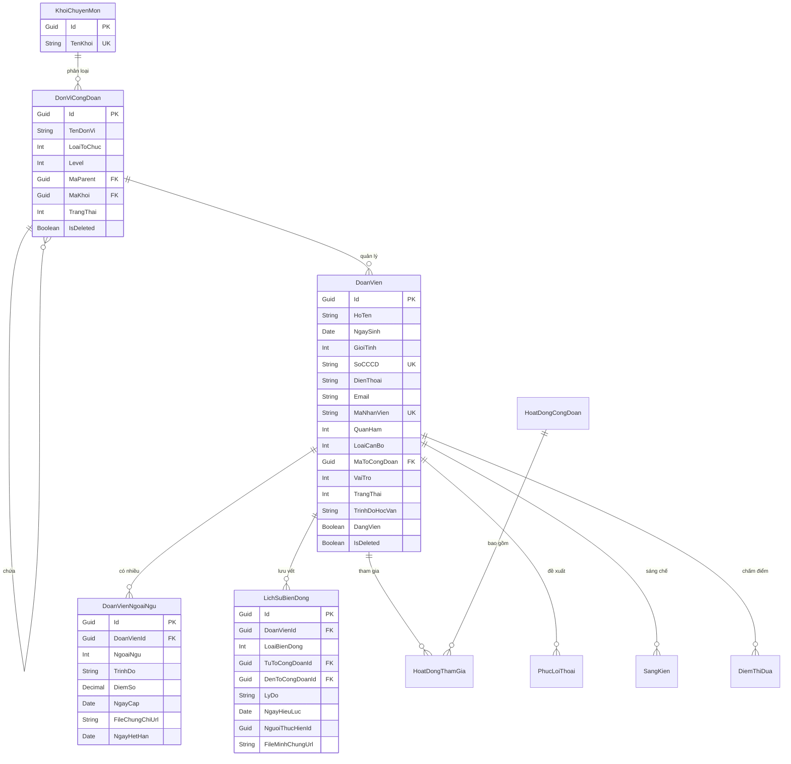

# 09. DATABASE DESIGN - THIẾT KẾ CƠ SỞ DỮ LIỆU HOÀN CHỈNH

Tài liệu này trình bày thiết kế chi tiết cơ sở dữ liệu hệ thống QLCD đảm bảo đầy đủ các mối quan hệ thực thể, ràng buộc kiểm tra và hỗ trợ cơ chế Soft Delete, Audit Log.

## 1. Sơ đồ Quan hệ Thực thể (Physical ERD Diagram)

## 2. Các bảng bổ sung phục vụ hệ thống nghiệp vụ hoàn chỉnh

### Bảng `AuditLog` (Ghi vết thay đổi dữ liệu)
* `Id` (Guid, PK)
* `EntityName` (Varchar(100), Tên bảng thay đổi)
* `RecordId` (Guid, ID của dòng dữ liệu)
* `Action` (Varchar(20), INSERT / UPDATE / DELETE)
* `OldValues` (Nvarchar(max), Định dạng JSON giá trị cũ)
* `NewValues` (Nvarchar(max), Định dạng JSON giá trị mới)
* `UserId` (Guid, ID người thực hiện)
* `Timestamp` (DateTime)

### Bảng `HoatDongCongDoan` (Quản lý hoạt động)
* `Id` (Guid, PK)
* `TenHoatDong` (Nvarchar(250))
* `MoTa` (Nvarchar(1000))
* `TuNgay` (DateTime)
* `DenNgay` (DateTime)
* `DiaDiem` (Nvarchar(250))
* `MaQRCode` (Varchar(100))
* `TrangThai` (Int)
* `IsDeleted` (Boolean)

### Bảng `HoatDongThamGia` (Đăng ký & Điểm danh)
* `Id` (Guid, PK)
* `HoatDongId` (Guid, FK)
* `DoanVienId` (Guid, FK)
* `NgayDangKy` (DateTime)
* `NgayCheckIn` (DateTime, Nullable)
* `HinhThucCheckIn` (Int: Web / QR Code)
* `TrangThai` (Int: Đăng ký / Đã tham gia / Vắng mặt)

### Bảng `PhucLoiThoai` (Quản lý cứu trợ & phúc lợi)
* `Id` (Guid, PK)
* `DoanVienId` (Guid, FK)
* `LoaiPhucLoi` (Int: Hiếu, Hỷ, Ốm đau, Thai sản, Khó khăn...)
* `KinhPhiHoTro` (Decimal(18,2))
* `LyDo` (Nvarchar(500))
* `FileMinhChungUrl` (Varchar(500))
* `TrangThai` (Int: ChoDuyetCDBP / ChoDuyetCDCS / DaDuyet / TuChoi)
* `NgayPheDuyet` (DateTime, Nullable)

### Bảng `SangKien` (Sáng kiến & Nghiên cứu khoa học)
* `Id` (Guid, PK)
* `DoanVienId` (Guid, FK)
* `TenDeTai` (Nvarchar(250))
* `LinhVuc` (Nvarchar(100))
* `HieuQuaKinhTe` (Nvarchar(1000))
* `NgayNghiemThu` (Date, Nullable)
* `TrangThai` (Int: DangNghienCuu / DaApDung / DongYeuCau)

### Bảng `DiemThiDua` (Bảng chấm điểm thi đua trực tuyến)
* `Id` (Guid, PK)
* `DoanVienId` (Guid, FK, Nullable - Nếu chấm điểm cho tập thể thì null)
* `DonViId` (Guid, FK, Nullable - Nếu chấm điểm cho cá nhân thì null)
* `NamHoc` (Int)
* `DiemTuDanhGia` (Decimal(5,2))
* `DiemToXet` (Decimal(5,2))
* `DiemCDBPDuyet` (Decimal(5,2))
* `DiemCDCSDuyet` (Decimal(5,2))
* `XepLoai` (Int: HoanThanhXuatSac / HoanThanhTot / HoanThanh / KhongHoanThanh)
