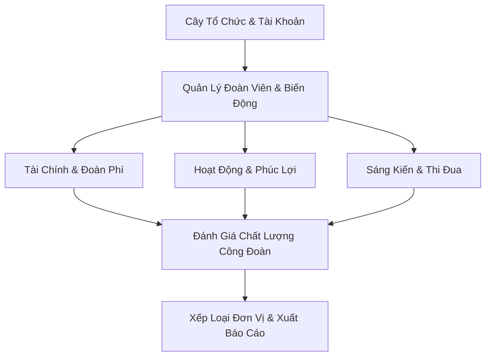

# QUY TRÌNH NGHIỆP VỤ & CÁC CHỨC NĂNG CỦA PHẦN MỀM QLCD
### DỰ ÁN: PHẦN MỀM QUẢN LÝ CÔNG TÁC CÔNG ĐOÀN (QLCD SỐ 108)

Tài liệu này mô tả chi tiết các luồng quy trình nghiệp vụ cốt lõi và danh sách các chức năng hiện có của phần mềm **QLCD**. Tài liệu này giúp người dùng chạy thử (Tester/End-User) hiểu rõ hành vi mong muốn của hệ thống để thực hiện kiểm thử và phản hồi đóng góp ý kiến.

---

## I. TỔNG QUAN HỆ THỐNG & SƠ ĐỒ PHÂN CẤP CÔNG ĐOÀN

Phần mềm QLCD phục vụ công tác quản lý của Công đoàn Bệnh viện TWQĐ 108 với cấu trúc phân cấp 3 cấp hành chính:
1. **Cấp 1: Công đoàn Cơ sở (CĐCS)** - Cấp Bệnh viện (Root).
2. **Cấp 2: Công đoàn Bộ phận (CĐBP)** hoặc Tổ Công đoàn trực thuộc CĐCS.
3. **Cấp 3: Tổ Công đoàn** (trực thuộc các CĐBP).

**Quy tắc bảo mật dữ liệu (Scope)**: Tài khoản quản lý ở cấp nào chỉ được quyền xem, sửa, và thao tác dữ liệu thuộc phạm vi đơn vị mình và các đơn vị con trực thuộc (Ví dụ: Tài khoản `CĐBP Khối Nội 1` không được xem thông tin đoàn viên của `CĐBP Ngoại Chấn thương`).

---

## II. CÁC QUY TRÌNH NGHIỆP VỤ CHÍNH

### 1. Quy trình Quản lý Đoàn viên & Biến động sinh hoạt
* **Nghiệp vụ**: Theo dõi hồ sơ đoàn viên từ lúc kết nạp, cập nhật trình độ học vấn/ngoại ngữ, cho đến khi chuyển sinh hoạt nội bộ hoặc ra khỏi công đoàn.
* **Luồng xử lý**:
  1. *Tiếp nhận đoàn viên*: Admin/CĐCS/CĐBP thực hiện thêm mới đoàn viên vào một Tổ Công đoàn cụ thể. Hệ thống yêu cầu mã nhân viên và CCCD là duy nhất.
  2. *Cập nhật hồ sơ*: Khai báo các thông tin chi tiết về trình độ chuyên môn, chức vụ chính quyền, thông tin Đảng viên, gia đình chính sách và danh sách chứng chỉ ngoại ngữ.
  3. *Chuyển sinh hoạt*: Khi đoàn viên chuyển bộ phận công tác, người quản lý thực hiện lệnh chuyển sinh hoạt sang Tổ Công đoàn mới, nhập lý do chuyển và bắt buộc tải lên quyết định điều động dạng file PDF để lưu minh chứng.
  4. *Quản lý trạng thái*: Cập nhật trạng thái sinh hoạt của đoàn viên (Đang sinh hoạt, Tạm dừng sinh hoạt, Nghỉ hưu, Chuyển đi).

---

### 2. Quy trình Quản lý Tài chính & Quỹ Công đoàn
* **Nghiệp vụ**: Đảm bảo tính minh bạch trong việc thu đoàn phí và chi tiêu các hoạt động của công đoàn.
* **Luồng xử lý**:
  1. *Thu đoàn phí*: Hàng tháng, cán bộ công đoàn thực hiện thu đoàn phí của từng đoàn viên (Hệ thống hỗ trợ nhập giao dịch thu, liên kết trực tiếp với mã đoàn viên và tháng đóng phí).
  2. *Ghi nhận nguồn thu khác*: Nhập các khoản thu từ kinh phí cấp trên cấp hoặc các nguồn thu xã hội hóa khác.
  3. *Ghi nhận chi tiêu*: Khi phát sinh chi hoạt động phong trào hoặc chi thăm hỏi phúc lợi (ốm đau, thai sản, hiếu hỷ), kế toán nhập giao dịch chi, ghi rõ số tiền, nội dung chi và người nhận.
  4. *Kết chuyển & Theo dõi*: Hệ thống tự động tính toán tổng thu, tổng chi và kết dư quỹ (tồn quỹ thực tế) của đơn vị theo thời gian thực.

---

### 3. Quy trình Tổ chức Hoạt động & Cứu trợ Phúc lợi
* **Nghiệp vụ**: Quản lý các phong trào thi đua, văn nghệ, thể thao và chăm lo đời sống đoàn viên.
* **Luồng xử lý**:
  1. *Lên kế hoạch hoạt động*: Tạo hoạt động mới, phân loại (Phong trào, Hội thảo, Văn nghệ, Thể thao...), nhập địa điểm, thời gian, kinh phí dự kiến.
  2. *Tổ chức & Ghi nhận kết quả*: Sau khi hoạt động kết thúc, người quản lý cập nhật kết quả thực tế, kinh phí chi trả thật và tải lên file PDF báo cáo/hình ảnh minh chứng.
  3. *Cứu trợ Phúc lợi*: Ghi nhận các trường hợp đoàn viên được nhận phúc lợi thăm hỏi (ốm đau, thai sản, khó khăn...) trích từ quỹ công đoàn.

---

### 4. Quy trình Quản lý Sáng kiến & Thi đua
* **Nghiệp vụ**: Ghi nhận và phê duyệt các đề tài sáng kiến, phong trào thi đua của cá nhân và tập thể để phục vụ công tác khen thưởng.
* **Luồng xử lý**:
  1. *Đăng ký sáng kiến*: Đoàn viên hoặc cán bộ công đoàn đăng ký sáng kiến mới (Tên đề tài, lĩnh vực, cấp sáng kiến).
  2. *Nghị quyết phê duyệt*: Ban chấp hành duyệt và cập nhật kết quả nghiệm thu (`Đã nghiệm thu đạt`). Sáng kiến được duyệt sẽ là dữ liệu đầu vào để tính toán chất lượng công đoàn.
  3. *Đăng ký thi đua*: Đăng ký danh hiệu thi đua cho tập thể hoặc cá nhân theo năm học/năm công tác.

---

### 5. Quy trình Đánh giá Chất lượng Công đoàn (CĐCS & CĐBP)
* **Nghiệp vụ**: Tổng hợp kết quả hoạt động định kỳ (quý, năm) để xếp loại chất lượng các đơn vị công đoàn theo 10 tiêu chuẩn quy định.
* **Luồng xử lý**:
  1. *Khởi tạo kỳ đánh giá*: Admin kích hoạt kỳ đánh giá (Ví dụ: Quý 2/2026).
  2. *Quét số liệu tự động*: Backend tự động truy vấn số liệu thật từ database cho các tiêu chí:
     * Tỉ lệ đóng đoàn phí đầy đủ (lấy từ dữ liệu đóng đoàn phí thực tế).
     * Tỉ lệ Đảng viên (lấy từ thông tin Đảng viên thật trong hồ sơ đoàn viên).
     * Tỉ lệ tham gia hoạt động phong trào và Tỉ lệ hoàn thành kế hoạch hoạt động.
     * Số lượng sáng kiến được duyệt đạt trong kỳ của đơn vị.
  3. *Nhập liệu bổ sung*: Cán bộ quản lý nhập các chỉ số định tính không thể tự động quét (Tổng số cán bộ nhân viên để tính tỉ lệ tham gia công đoàn, tỉ lệ giới thiệu Đảng, tỉ lệ nữ tham gia BCH, số vụ kỷ luật, tỉ lệ hài lòng).
  4. *Xem dự thảo & Chốt kết quả*: Xem điểm số chi tiết từng tiêu chí (thang 10/tiêu chí, tổng 100 điểm) và xếp loại dự kiến. Nhấp **"Lưu & Chốt"** để lưu chính thức.
  5. *Đính kèm minh chứng*: Tải lên file PDF quyết định, công văn làm minh chứng cho từng tiêu chí đạt được.

---

## III. BẢN ĐỒ CHỨC NĂNG TRÊN GIAO DIỆN (FRONTEND MODULES)

Khi chạy thử phần mềm, các đồng chí sẽ thao tác trên các menu giao diện chính sau:

### 1. Phân hệ Tổng quan (Dashboard)
* **Chức năng**: 
  * Hiển thị biểu đồ phân bố đoàn viên theo khối chuyên môn, chức vụ, trình độ học vấn.
  * Biểu đồ doanh thu/chi tiêu quỹ công đoàn theo tháng.
  * Các chỉ số thống kê nhanh (Tổng số đoàn viên, tỉ lệ Đảng viên, tổng tồn quỹ, số sáng kiến...).

### 2. Phân hệ Cây Tổ Chức (Organization Tree)
* **Chức năng**:
  * Hiển thị cấu trúc cây sơ đồ của Công đoàn Bệnh viện.
  * Cho phép thêm/sửa/xóa các Công đoàn bộ phận hoặc Tổ công đoàn trực thuộc.
  * Quản lý phân chia khối chuyên môn (Khối Cơ quan, Khối Nội, Khối Ngoại, Cận lâm sàng).

### 3. Phân hệ Quản lý Đoàn viên (Members)
* **Chức năng**:
  * Hiển thị danh sách đoàn viên hỗ trợ tìm kiếm nhanh, lọc theo tổ công đoàn, vai trò, trạng thái.
  * Form thêm mới/cập nhật chi tiết hồ sơ đoàn viên (Thông tin cá nhân, chức vụ, học vị, thông tin Đảng).
  * Quản lý chứng chỉ ngoại ngữ của từng đoàn viên.
  * Chức năng chuyển sinh hoạt tổ công đoàn kèm đính kèm file PDF.

### 4. Phân hệ Tài chính & Đoàn phí (Finance)
* **Chức năng**:
  * Danh sách giao dịch thu/chi tài chính của đơn vị.
  * Lọc giao dịch theo loại thu chi, khoảng thời gian.
  * Form lập phiếu thu đoàn phí tháng cho đoàn viên hoặc lập phiếu chi hoạt động, phúc lợi.

### 5. Phân hệ Chất lượng Công đoàn (Quality)
* **Chức năng**:
  * Bộ lọc chọn đơn vị cần đánh giá, chọn năm, chọn kỳ (Quý/Cả năm).
  * Thẻ thống kê tổng hợp: Xếp loại (Xuất sắc, Vững mạnh, Hoàn thành tốt, Chưa hoàn thành), Tỉ lệ tiêu chí đạt, Điểm trung bình.
  * Bảng chi tiết 10 tiêu chí: Mục tiêu, Thực tế, Tiến độ (thanh phần trăm trực quan), Điểm số, Đạt/Chưa đạt.
  * Chức năng tải lên và tải xuống file minh chứng PDF cho mỗi dòng tiêu chí.
  * Modal tính toán dự thảo & Nhập liệu thủ công cho các chỉ số đặc thù.
  * Hộp ghi nhận nhận xét/ghi chú tổng thể của người đánh giá.

### 6. Phân hệ Nghiệp vụ khác
* **Hoạt động Công đoàn**: Tạo hoạt động, cập nhật kinh phí thực tế, kết quả và minh chứng.
* **Phúc lợi & Cứu trợ**: Cấp hỗ trợ cho đoàn viên khó khăn, thai sản, đau ốm.
* **Sáng kiến & Đề tài**: Ghi nhận và duyệt sáng kiến/đề tài nghiên cứu khoa học.
* **Thi đua trực tuyến**: Đăng ký các danh hiệu thi đua tập thể/cá nhân.
* **Cấu hình Hệ thống & Danh mục**: Admin quản lý các danh mục dùng chung (dân tộc, tôn giáo, loại thi đua, loại thu chi...) và quản lý tài khoản người dùng (cấp mật khẩu mới, kích hoạt/khóa tài khoản).
